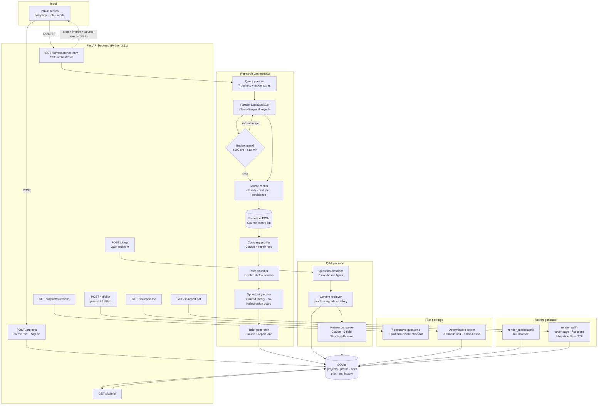
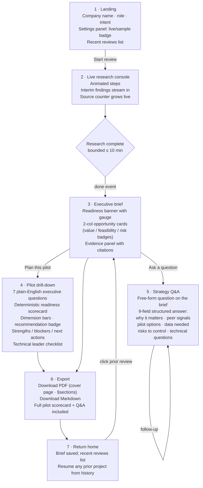
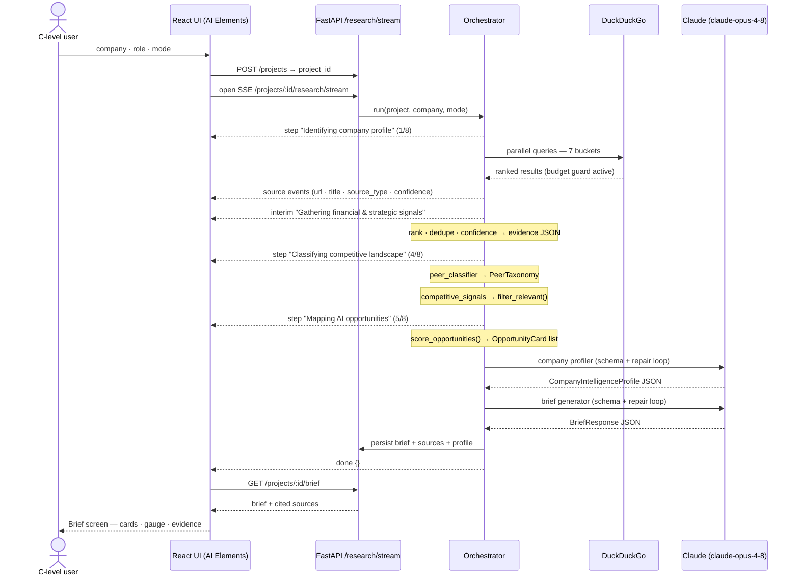
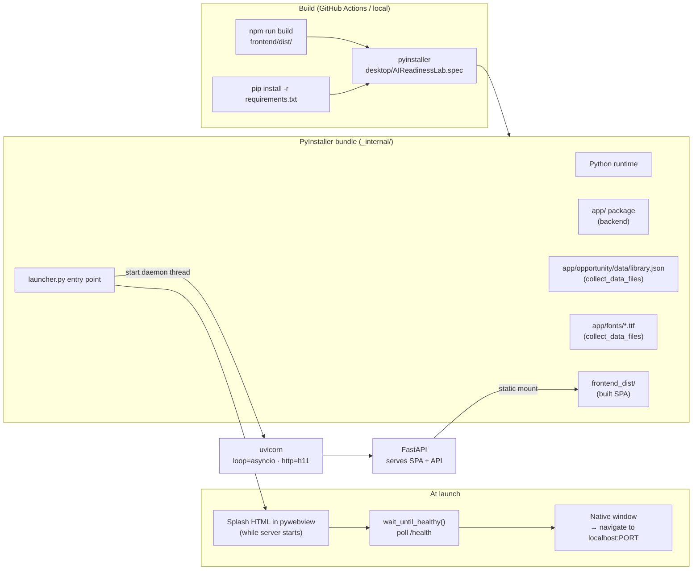

<!--
ROLE OF THIS DOCUMENT
Visual reference for how AI Readiness Lab flows end-to-end — both the technical
pipeline and what the executive actually sees. Keep these diagrams in sync with
the code as the system evolves. Companion docs: docs/IMPLEMENTATION_PLAN.md (how/when),
docs/PRODUCT_SPEC.md (what/why).
-->

# AI Readiness Lab — Architecture & Flow

**Last updated:** 2026-06-12

This document maps the complete, shipped system in four views:

1. **Technical pipeline** — intake → research → brief → pilot → export.
2. **User journey** — what a C-level user sees, screen by screen.
3. **Streaming "show your work"** — the SSE event contract in detail.
4. **Desktop app packaging** — how the app is bundled and delivered.

---

## Key design decisions

| Area | Decision | Rationale |
| --- | --- | --- |
| Frontend UI kit | **AI Elements (shadcn/ui)** — copy-paste React components owned in-repo | Maximum extensibility; native streaming/step/citation primitives; built on Radix + Tailwind. |
| Web search | **DuckDuckGo by default** (no API key). Tavily / Serper opt-in via env key. | Works out of the box; richer providers are a one-env-var swap. |
| Research budget | **≤ 100 sources · ≤ 10 minutes** (`RESEARCH_MAX_SOURCES`, `RESEARCH_TIMEOUT_SECONDS`) | Deep research must terminate; synthesizes from evidence gathered so far on budget hit. |
| Progress UX | **Streaming via SSE** — live step labels, interim findings, and source counter | Executives must see "what the agent is doing" — never a silent spinner. |
| Peer classification | **Rule-based curated dict → reason string** | Explicit, auditable; unknown companies defer to `adjacent_benchmark` rather than guessing. |
| Pilot scoring | **Deterministic rubric** — identical inputs always yield identical scores | Verifiable; no LLM needed; works offline; fast. |
| API key | **OS keychain** (`keyring`) with 0600-file fallback; only `…last4` hint returned to UI | Compliant with Anthropic's policy (BYOK, no OAuth); secure by default. |
| Desktop packaging | **PyInstaller + pywebview** — single `.app`/`.exe`, no Python install required | One double-click for a non-technical executive. |
| Reports | **fpdf2 + Liberation Sans TTF** — cover page, section numbering, native Unicode | Board-ready PDF; em-dashes, curly quotes, and arrows render natively. |
| LLM | **Claude `claude-opus-4-8`** for company profiling and brief generation | Best reasoning available; structured JSON output validated by Pydantic + repair loop. |

---

## 1. Complete technical pipeline

---

## 2. User journey

**Principles**

- **Two facts to start:** company name + role. No model pickers, no infra config.
- **Never silent:** status + interim findings stream the whole time research runs.
- **Visual, not a wall of text:** cards, coloured badges, a circular readiness gauge, and a cited evidence panel.
- **Every screen has a next move:** drill into evidence, plan a pilot, ask a follow-up, or export.
- **Persistent:** every brief survives a window close; the landing screen links to all prior projects.

---

## 3. Streaming "show your work" sequence

**SSE event contract**

| Event | Payload | Status |
| --- | --- | --- |
| `step` | `{ index, total, label }` | implemented |
| `interim` | `{ label, detail }` | implemented |
| `source` | `{ url, title, source_type, confidence }` | implemented |
| `done` | `{}` — client closes SSE, fetches brief | implemented |
| `error` | `{ message }` | implemented (client-side) |

---

## 4. Desktop app packaging

**Notes**

- `launcher.py` (not `app.py`) avoids shadowing the backend `app` package under PyInstaller.
- `ensure_writable_db()` moves SQLite to the user config dir when the app is frozen (macOS `.app` bundle is read-only).
- `_setup_logging()` writes `launch.log` to config dir; redirects `sys.stdout/stderr` (both are `None` in `console=False` builds).
- The browser fallback (`webbrowser.open`) ensures the app works even without pywebview.
- Release workflow: `.github/workflows/release.yml` matrix-builds Windows `.zip`, macOS `.dmg`, Linux `.tar.gz` on a `v*` tag.
