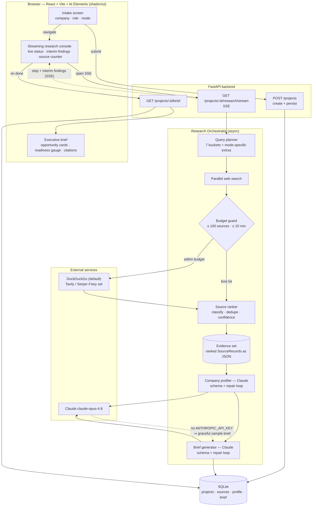
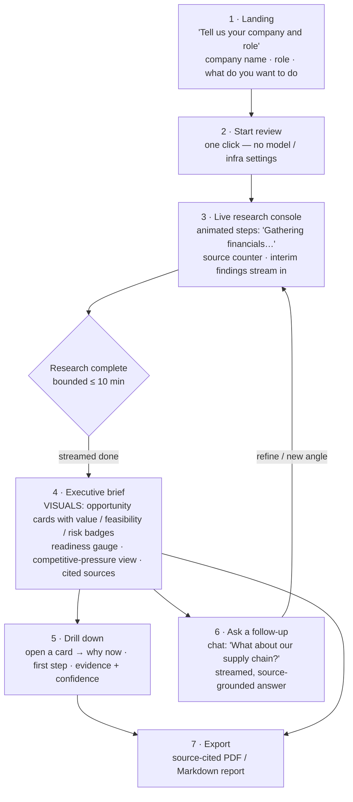
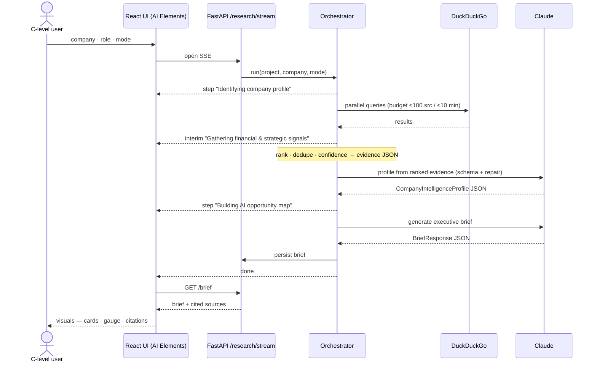

<!--
ROLE OF THIS DOCUMENT
Visual reference for how AI Readiness Lab flows end-to-end — both the technical
pipeline and what the executive actually sees. Keep these diagrams in sync with
the code as the system evolves. Companion docs: docs/IMPLEMENTATION_PLAN.md (how/when),
docs/PRODUCT_SPEC.md (what/why).
-->

# AI Readiness Lab — Architecture & Flow

**Last updated:** 2026-06-11

This document maps the complete flow in two views, as requested for onboarding and
design review:

1. **Technical flow** — the request/streaming pipeline from intake to a cited brief.
2. **User journey** — what a C-level user sees and does, screen by screen.

A third **streaming sequence** diagram details the live "show your work" protocol.

---

## Key design decisions captured here

| Area | Decision | Rationale |
| --- | --- | --- |
| Frontend UI kit | **AI Elements (shadcn/ui)** — copy-paste React components we own in-repo (Conversation, Message, Reasoning, Tool, Task, Sources) | Don't reinvent the wheel; maximum extensibility since the code lives in our repo; first-class streaming + tool/step + citation primitives. Built on Radix + Tailwind, works with Vite. |
| Web search | **DuckDuckGo by default** (free, open-source, no API key). Tavily / Serper are opt-in upgrades when a key is set. | Research works out of the box with zero secrets; richer providers are a one-env-var swap. |
| Research budget | Every run is **bounded: ≤ 100 sources and ≤ 10 minutes** (`RESEARCH_MAX_SOURCES`, `RESEARCH_TIMEOUT_SECONDS`). | Deep research must terminate; on a budget hit we synthesize from evidence gathered so far rather than hanging. |
| Progress UX | **Streaming** via SSE — the UI shows live status and interim findings; it never sits silent while work runs. | Executives must see "what the agent is doing" — gathering financials, scanning competitors, etc. |
| Evidence | Ranked sources accumulate into a **JSON evidence set** (`SourceRecord`s with `source_type` + `confidence`) before any synthesis. | Every claim must trace to a cited source; synthesis reads only validated evidence. |

---

## 1. Technical flow

**Notes**

- **Graceful degradation.** No `ANTHROPIC_API_KEY` → search still runs (DuckDuckGo), but
  synthesis is skipped and a clearly-flagged `is_sample` brief is returned. No keys at all
  and DuckDuckGo unavailable → the mock path fires the same paced steps so the demo always works.
- **Validate at the boundary.** Both Claude calls pass through the Pydantic schema + repair loop;
  raw model JSON never reaches the UI or DB.

---

## 2. User journey (what the executive sees)

**Principles**

- The user gives **two facts** (company, role) plus an intent, and never touches a technical knob.
- The console is **never silent** — status and interim findings stream the whole time.
- The payoff is **visual, not a wall of text** — cards, badges, a readiness gauge, and citations.
- Every screen offers a **next move**: drill into evidence, ask a follow-up, or export.

---

## 3. Streaming "show your work" sequence

**SSE event contract** (current + planned)

| Event | Payload | Status |
| --- | --- | --- |
| `step` | `{ index, total, label }` — coarse progress | implemented |
| `interim` | `{ label, detail }` — "gathering X", partial finding | planned (Phase 4 console) |
| `source` | `{ url, source_type, confidence }` — live source counter | planned (Phase 4 console) |
| `done` | `{}` — sentinel; client closes SSE, fetches brief | implemented |
| `error` | `{ message }` — terminal failure | implemented (client-side) |
